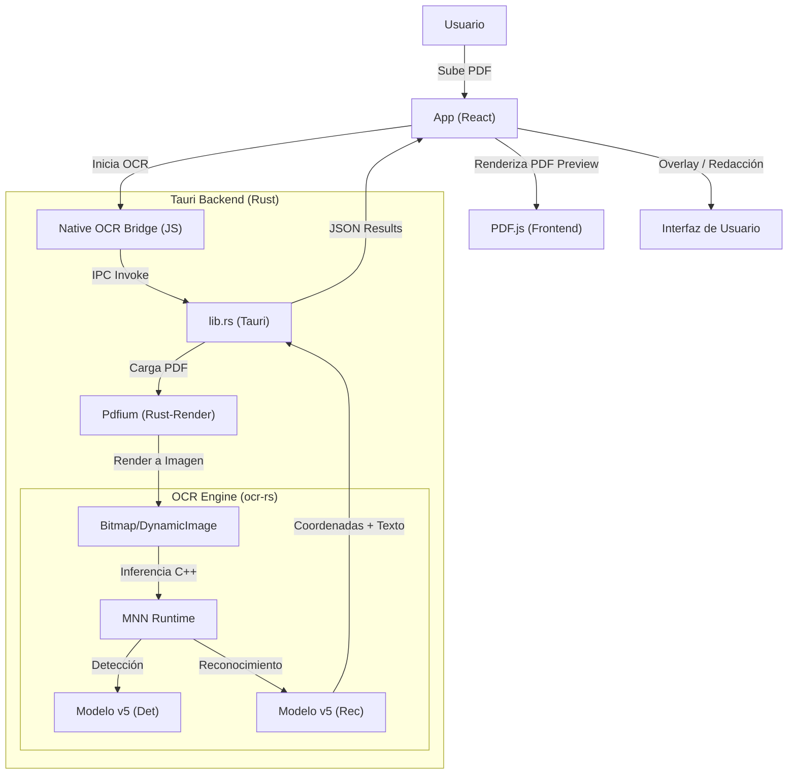

# Arquitectura General del Proyecto

Este documento describe la arquitectura de alto nivel de **GlyphAtlas Editor**. La aplicación ha evolucionado de un motor basado en navegador a un sistema híbrido de alto rendimiento con un backend de OCR nativo en Rust.

## Diagrama de Flujo Principal

## Componentes Clave

### 1. Frontend (React + Vite)
- **App.tsx**: Orquestador de la interfaz. Maneja el estado global del documento activo y los resultados del OCR.
- **EmbedPDFViewer**: Componente de visualización avanzado que renderiza el PDF original y superpone las capas de geometría de texto obtenidas del backend.
- **Selection Plugin**: Gestiona la interacción con el texto reconocido, permitiendo la selección y búsqueda precisa.

### 2. Backend (Rust + Tauri)
- **lib.rs**: Define los comandos IPC. Expone el comando `perform_paddle_ocr`.
- **ocr_paddle.rs**: Módulo central del OCR. Maneja la integración con `ocr-rs` y el renderizado de páginas mediante `pdfium-render`. Proporciona la lógica de "instancia fresca" para mantener una precisión del 98%.

### 3. OCR Engine (Nativo)
- **ocr-rs**: Crata que vincula el código de Rust con el SDK nativo de PaddleOCR en C++.
- **MNN Runtime**: Motor de inferencia ultrarrápido optimizado para CPU, eliminando la necesidad de WebGPU o WebAssembly pesado en el frontend.

## Flujo de Datos
1. **Input**: Ruta absoluta del archivo PDF.
2. **Procesamiento (Rust)**:
    - Se renderiza la página solicitada a una resolución de 400 DPI (o 800 DPI en modo High).
    - Se invoca el motor PaddleOCR v5.
3. **Output**: Lista de "Palabras" con coordenadas normalizadas (0..1), texto y confianza.
4. **Visualización**: La UI mapea estas coordenadas al tamaño actual del visor para crear una experiencia de texto seleccionable sobre una imagen.
