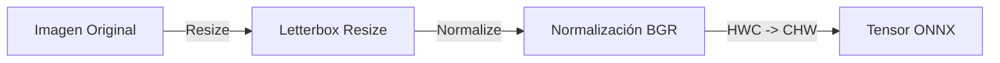

# Procesamiento de Imágenes

El motor OCR utiliza `opencv.js` y operaciones de Canvas raw para preparar las imágenes antes de enviarlas a los modelos de IA. Este paso es crítico para la precisión.

## Pipeline de Preprocesamiento

### 1. Letterbox Resize (Detección)
Para el modelo de detección, la imagen debe redimensionarse manteniendo su relación de aspecto, pero ajustándose a múltiplos de 32 (stride del modelo).

- **Lógica**:
    - Se calcula un factor de escala para que el lado más largo sea (por defecto 960px o 2176px en Alta Precisión).
    - Se añade "padding" (negro) a la derecha y abajo para completar el tamaño múltiplo de 32.
    - **Importante**: No se deforma la imagen.

### 2. Normalización
Los modelos PaddleOCR esperan valores normalizados específicos:
- **Mean**: `[0.485, 0.456, 0.406]`
- **Std**: `[0.229, 0.224, 0.225]`
- **Escala**: 1/255.0

### 3. Recorte de Regiones (Reconocimiento)
Una vez detectadas las cajas de texto:
1. Se recorta cada caja de la imagen original (usando `opencv.js` `warpPerspective` si la caja está rotada, o simple crop si es recta).
2. Se redimensiona la altura a 48px.
3. Se mantiene el ancho proporcional (con un máximo de 320px).
4. Se normaliza nuevamente antes de pasar al modelo de reconocimiento.

## Optimizaciones Implementadas
- **Shared Canvas**: Se utiliza un único elemento `OffscreenCanvas` global para todas las operaciones de redimensionamiento, evitando la creación costosa de elementos DOM en cada frame.
- **Desactivación de Dilation**: Se desactivó la dilatación de máscaras en el postprocesamiento para obtener cajas más ajustadas al texto real (Paridad con versión Node.js).
- **Unclip Ratio**: Se ajustó a 1.5 para expandir ligeramente las cajas detectadas y evitar cortar caracteres extremos.
