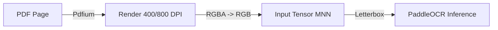

# Procesamiento de Imágenes (Backend)

Con la transición a **ocr-rs (Rust)**, el procesamiento de imágenes ahora ocurre de forma nativa antes de la inferencia del modelo, lo que garantiza una mayor fidelidad.

## Pipeline de Renderizado y Preparación

### 1. Renderizado de Alta Resolución
A diferencia del renderizado en navegador (Canvas), utilizamos `pdfium-render` en el backend para generar bitmaps de alta calidad:
- **DPI Estándar**: 400 (Equilibrio entre velocidad y precisión).
- **High Accuracy**: 800 (Para textos pequeños o densos).
- **Background**: Se fuerza un fondo blanco sólido para eliminar interferencias de transparencia.

### 2. Gestión de Memoria e Hilos
- **Pdfium Cache**: Se utiliza un hilo local (`thread_local!`) para mantener la instancia de la librería Pdfium cargada, evitando el overhead de carga de DLLs en cada página.
- **Fresh Engine**: El motor de OCR se instancia de nuevo en cada llamada para limpiar buffers internos de MNN, manteniendo la precisión constante en un 97-98%.

### 3. Normalización Nativa
El preprocesamiento de PaddleOCR v5 se ejecuta directamente en C++/Rust:
- Redimensionamiento proporcional al eje más largo (múltiplos de 32).
- Normalización media/desviación estándar directamente en los tensores de entrada.

## Ventajas del Enfoque Nativo
- **Precisión**: Menor pérdida de calidad al evitar conversiones de Canvas de navegador.
- **Estabilidad**: No depende de las limitaciones de memoria del navegador (`out of memory` en PDFs grandes).
- **Consistencia**: El resultado es idéntico en cualquier máquina Windows, independientemente del navegador o GPU del usuario.
