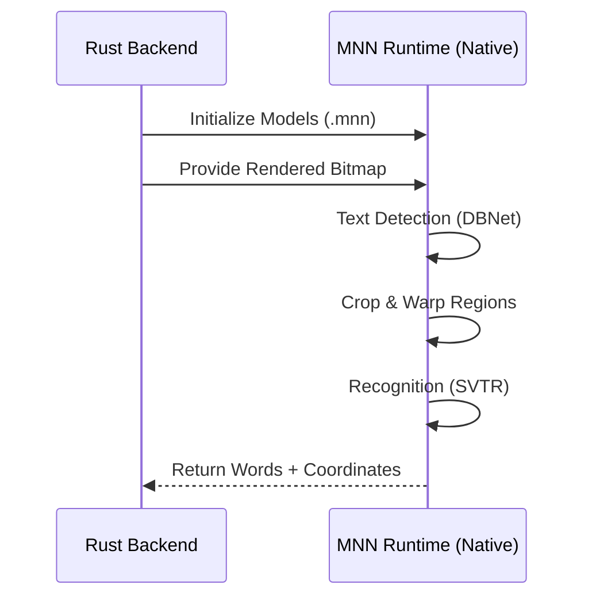

# Modelos de IA (MNN Native)

La aplicación utiliza modelos de **PaddleOCR v5** optimizados para el motor de inferencia **MNN (Mobile Neural Network)** ejecutándose de forma nativa en el backend de Rust.

## 1. Detección (DBNet v5)
- **Modelo**: `PP-OCRv5_mobile_det.mnn`
- **Función**: Segmentación de texto en la página.
- **Entrada**: Imagen de página completa escalada (múltiplos de 32).
- **Salida**: Polígonos de detección de texto.

## 2. Reconocimiento (SVTR-LCNet v5)
- **Modelo**: `latin_PP-OCRv5_mobile_rec_infer.mnn`
- **Función**: Transcripción de caracteres para el alfabeto latino.
- **Arquitectura**: Basada en SVTR (Scene Text Recognition Transformer) optimizada con LCNet para alta velocidad en CPU.
- **Vocabulario**: `ppocr_keys_latin.txt`.

## Flujo de Inferencia Nativo

## Especificaciones de los Modelos
- **Formato**: MNN (Binario optimizado).
- **Tamaño**: ~13MB en total (extremadamente eficiente).
- **Optimización**: Los modelos están configurados para ejecutarse en CPU mediante instrucciones vectorizadas, lo que permite un rendimiento similar a GPU sin la complejidad de drivers específicos.
- **Precisión**: Orientado a documentos de oficina y formularios, con soporte mejorado para caracteres latinos y símbolos.

## Ubicación de Archivos
Los modelos se encuentran en la carpeta `public/models/paddle/` y el instalador de Tauri los empaqueta automáticamente como recursos del sistema para que estén disponibles en tiempo de ejecución.
