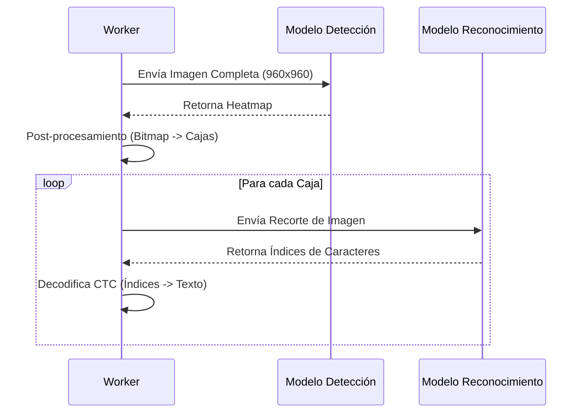

# Modelos de IA

La aplicación utiliza modelos exportados de **PaddleOCR v4**, convertidos a formato **ONNX** para su ejecución en el navegador.

## 1. Detección de Texto (DBNet)
- **Modelo**: `ch_PP-OCRv4_det_infer.onnx`
- **Arquitectura**: Differentiable Binarization (DB).
- **Entrada**: Tensor `[1, 3, H, W]` (Imagen RGB dinámica).
- **Salida**: Mapa de probabilidad (Heatmap) donde los píxeles blancos indican texto.
- **Función**: Localizar dónde hay texto en la página, sin importar qué dice.

## 2. Reconocimiento de Texto (SVTR/CRNN)
- **Modelo**: `ch_PP-OCRv4_rec_infer.onnx`
- **Arquitectura**: SVTR (Recognition Transformer) + CTC Head.
- **Entrada**: Tensor `[1, 3, 48, W]` (Imagen de una sola línea de texto).
- **Salida**: Matriz de probabilidades sobre el vocabulario (caracteres).
- **Decodificación**: Algoritmo CTC (Connectionist Temporal Classification) para convertir la matriz en string final, eliminando duplicados y blanks.

## Flujo de Inferencia

## Configuración de ONNX Runtime
- **Backend**: `wasm` (WebAssembly) o `webgpu` (si está disponible y configurado).
- **Threads**: Configurado para usar múltiples hilos (numThreads) para acelerar la CPU si WebGPU no está disponible.
- **Archivos**: Los modelos `.onnx` deben alojarse en la carpeta `public/` para ser accesibles via `fetch`.
